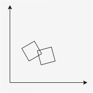

[Home](../README.md#game-engine-2d---collisions) / [Definições](../README.md#definições) / [OBB](./OBB.md)

___

# OBB - Oriented Bounding Boxes

OBB é um termo muito utilizado quando tratamos de geometria. Em uma definição simplória, *OBB* são caixas que podem estar rotacionadas/não orientadas em seu eixo.

