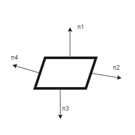

[Home](../README.md) / [Definições](../README.md#definições) / [Normal](./normal.md)

___

# Normal

Em geometria, uma *normal* é um objeto, como uma linha ou vetor, que é perpendicular a uma superfície em um dado ponto. Ou seja, se temos uma linha, sua normal seria um vetor a 90° de sua direção.

No exemplo abaixo temos um polígono com 4 lados e estamos identificando a normal de cada face (n1, n2, n3 e n4):

