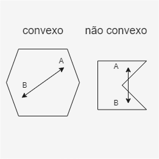

[Home](../README.md) / [Definições](../README.md#definições) / [Polígono](./polygon.md)

___

# Polígono

É uma linha fechada inteiramente formada por segmentos de reta que não se cruzam, exceto em suas extremidades.

Note na figura abaixo que apenas o último desenho da direita é um polígono, pois o primeiro não está fechado e o segundo seus **segmentos de reta** se cruzam:

> **Segmento de reta**: Uma linha que é limitada por dois pontos, A e B.

### Polígonos convexos e não convexos

Um polígono é chamado convexo quando, dados os pontos A e B em seu interior, o segmento AB está totalmente contido no interior do polígono, independentemente da posição dos pontos AB. Dessa forma, é impossível encontrar dois pontos AB no interior do polígono, de modo que pelo menos um ponto do segmento AB esteja no exterior desse polígono.

No caso de encontrar, pelo menos, um segmento AB com ao menos um ponto no **exterior do polígono**, então essa figura é chamada *não convexa*.

