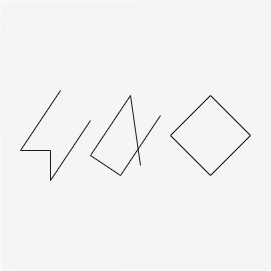

[Home](../README.md#home) / [Definições](../README.md#definitions) / [Polígono](./polygon.md#polygon)

___

<h1 id="polygon">Polígono</h1>

É uma linha fechada inteiramente formada por segmentos de reta que não se cruzam, exceto em suas extremidades.

Note na figura abaixo que apenas o último desenho da direita é um polígono, pois o primeiro não está fechado, e o segundo, seus **segmentos de reta** se cruzam:

> **Segmento de reta**: Uma linha que é limitada por dois pontos, A e B.

<h3 id="convex__not-convex">Polígonos convexos e não convexos</h3>

Um polígono é chamado convexo quando, dados os pontos A e B em seu interior, o segmento AB está totalmente contido no interior do polígono, independentemente da posição dos pontos AB, caso contrário, esse polígono é chamado de *não convexo*.

