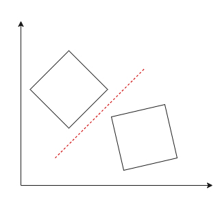
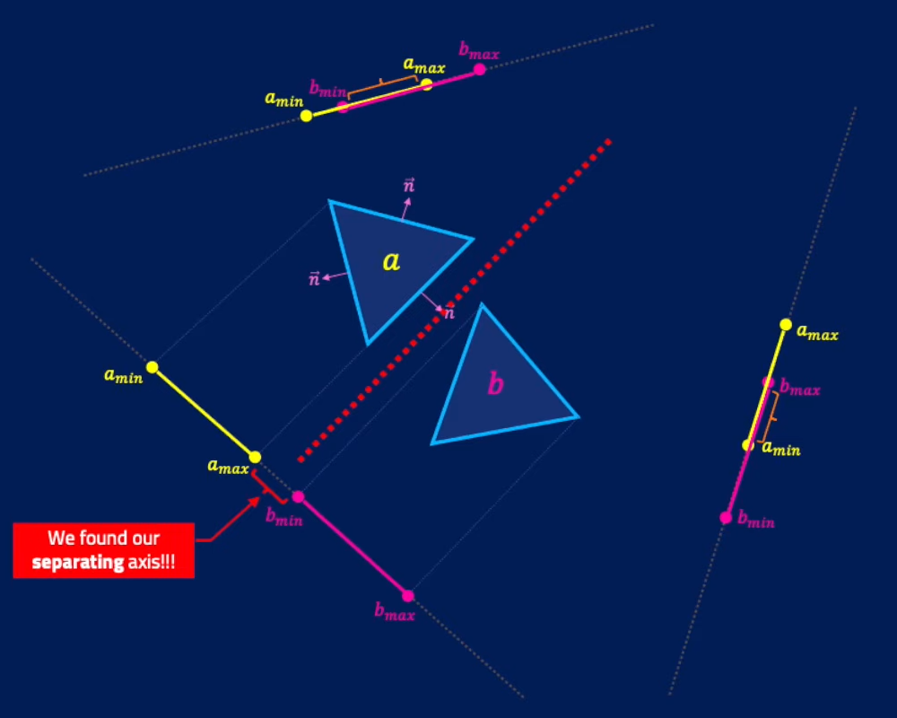

[Home](../../../README.md#home) / [Teoremas](../../../README.md#theorems) / [SAT](./README.md#sat)

___

<h1 id="sat">SAT - Separation Axis Theorem</h1>

SAT detecta colisões entre qualquer [OBB](../../../doc/OBB.md#obb) e funciona com qualquer [polígono](../../../doc/polygon.md#polygon) [convexo](../../../doc/polygon.md#convex__not-convex), ou seja, qualquer polígono independênte de sua rotação, será detectado.

> É possível fazer a deteção também entre polígono-círculo e círculo-círculo considerando o ponto central do círculo como uma aresta e somando seu raio.

O algoritmo SAT nos diz que, **se pelo menos um eixo separa** ambas as formas (polígonos), então podemos dizer com certeza que eles **NÃO** estão colidindo.

No exemplo abaixo temos dois triângulos, então aplicando o teorema SAT, estamos criando um eixo fictício na [normal](../../../doc/normal.md#normal) de cada face e então verificando se a projeção de alguma aresta do objeto A está sobreponto o objeto B e vice versa.

> Lembrando que, caso exista pelo menos um eixo que separa os objetos, o teorema afirma que os objetos **NÃO** estão colidindo.

 

Abaixo temos uma animação, que facilita a compreensão do teorema e do porquê caso exista pelo menos **1** eixo de separação (marcado em verde) garante que os objetos **NÃO** estão colidindo.

 

<h2 id="coding">Aplicando no código</h2>

Existem diversas maneiras de aplicar o algoritmo SAT, e em nosso caso vamos fazer isso calculando a separação do eixo mínima para cada um dos polígonos.

Vamos seguir alguns passos para isso:

- Vamos percorrer **todos os vértices** do [polígono](../../../doc/polygon.md#polygon) **A**, encontrando a [normal](../../../doc/normal.md#normal) de cada [aresta](../../../doc/polygon)
- Para cada eixo [normal](../../../doc/normal.md#normal) encontrados acima, vamos percorrer **todos vértices** do polígono **B**
- Obtemos a separação de cada vértice de **B** projetando-os no eixo normal
  - Se o valor da separação do eixo for **positivo**, então não temos uma sobreposição
  - Se o valor da separação do eixo for **negativo**, então temos uma sobreposição
