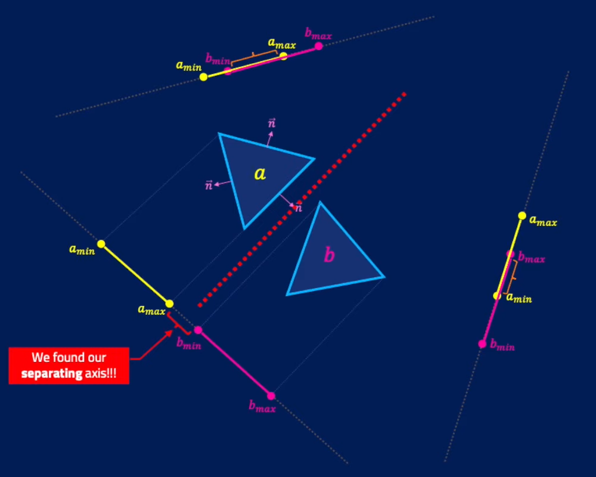

[Home](../../../README.md#home) / [Teoremas](../../../README.md#theorems) / [SAT](./README.md#sat)

___

<h1 id="sat">SAT - Separation Axis Theorem</h1>

SAT detecta colisões entre qualquer [OBB](../../../doc/OBB.md#obb) e funciona com qualquer [polígono](../../../doc/polygon.md#polygon) [convexo](../../../doc/polygon.md#convex__not-convex), ou seja, qualquer polígono independênte de sua rotação, irá ser detectado.

> É possível fazer a deteção também entre polígono-círculo e círculo-círculo considerando o ponto central do círculo como uma aresta e somando seu raio.

O algoritmo SAT nos diz que, **se pelo menos um eixo separa** ambas as formas (polígonos), então podemos dizer com certeza que eles **NÃO** estão colidindo.

No exemplo abaixo temos dois triângulos, então aplicando o teorema SAT, estamos criando um eixo fictício na [normal](../../../doc/normal.md#normal) de cada face e então verificando se a projeção de alguma aresta do objeto A está sobreponto o objeto B e vice versa.

Arestas não sobrepostas estão circuladas na cor **verde** e arestas sobrepostas estão circuladas na cor **vermelha**.

> Lembrando que, caso exista pelo menos um eixo que separa os objetos, o teorema afirma que os objetos **NÃO** estão colidindo.

